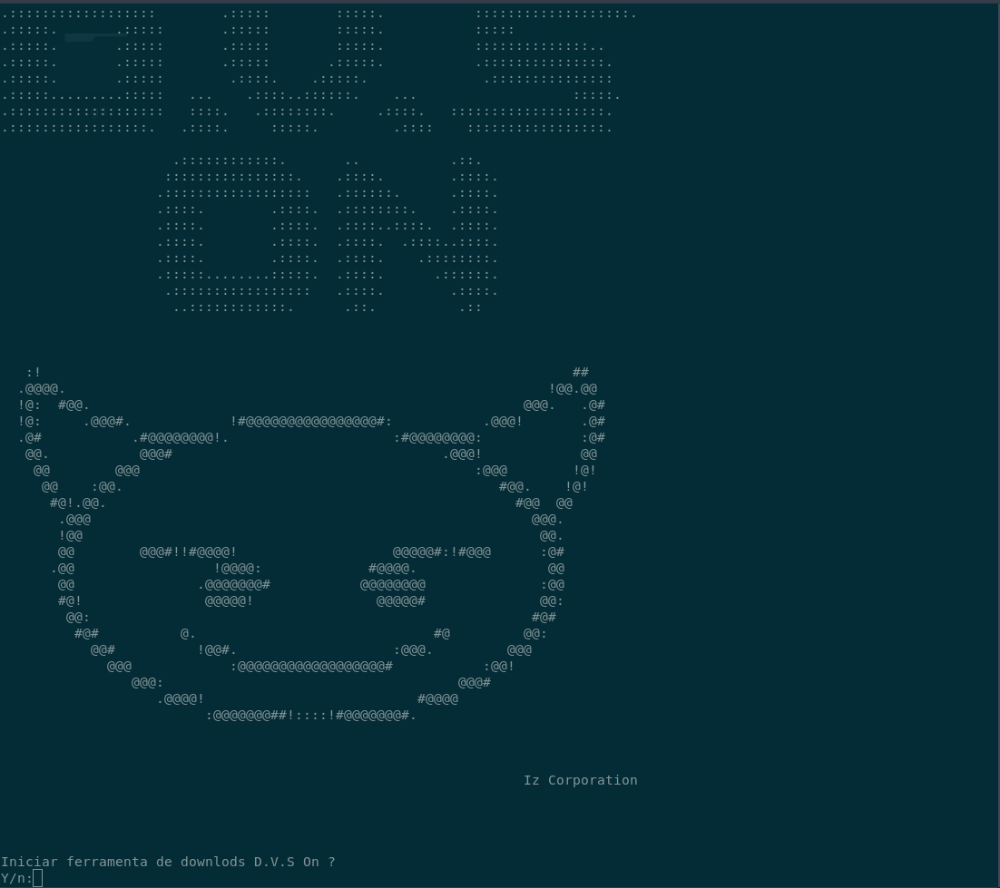

# DVSon

DVSon é uma ferramento desenvolvida em Python para facilitar usuarios do linux no download de videos ou audios do Youtube via terminal, de uma forma simplificada.

#Instalação

De forma simplificada um arquivo install.sh ira confifurar a o ambiente para utilização da ferramenta.
Atualizando repositorisos automaticamente e realisando a configuração das dependencias.

### 'Execute os comando no terminal'

'git clone https://github.com/MyCodesIz/DVSon.git'
'cd DVSon'
'chmod +x install.sh'
'sh install.sh'

### 'Apos instalação concluida inicia a ferramento via terminal'

'dvs'

